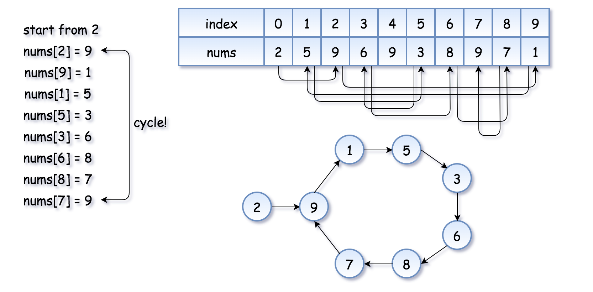
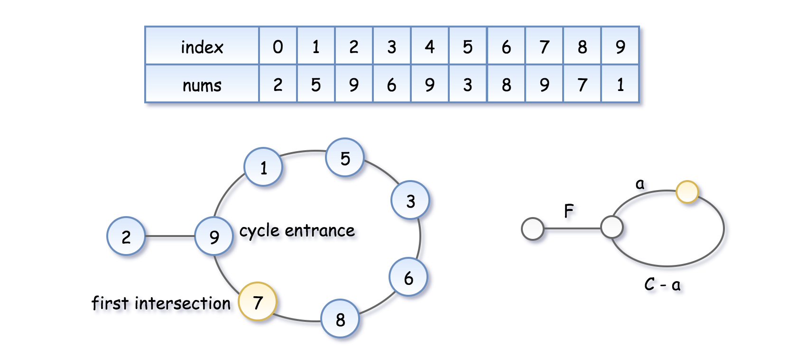

# 287. Find the Duplicate Number

## Proof

Proving that at least one duplicate must exist in `nums` is an application of the [pigeonhole principle](https://en.wikipedia.org/wiki/Pigeonhole_principle). Here, each number in `nums` is a "pigeon" and each distinct number that can appear in `nums` is a "pigeonhole". Because there are `n+1` numbers and `n` distinct possible numbers, the pigeonhole principle implies that if you were to put each of the `n+1` pigeons into `n` pigeonholes, at least one of the pigeonholes would have 2 or more pigeons.

## Approach 7: Floyd's Tortoise and Hare (Cycle Detection)

**Intuition**

The idea is to reduce the problem to [Linked List Cycle II](https://leetcode.com/problems/linked-list-cycle-ii):

>Given a linked list, return the node where the cycle begins.

First of all, where does the cycle come from? Let's use the function `f(x) = nums[x]` to construct the sequence:

```
x, nums[x], nums[nums[x]], nums[nums[nums[x]]], ...
```

Each new element in the sequence is an element in `nums` at the index of the previous element.

If one starts from `x = nums[0]`, such a sequence will produce a linked list with a cycle.

**NOTE**: The cycle appears because `nums` contains duplicates. The duplicate node is a cycle entrance.

Here is how it works:


The example above is simple because the loop is small. Here is a more interesting example:



Now the problem is to find the entrance of the cycle.

**Algorithm**

[Floyd's algorithm](https://en.wikipedia.org/wiki/Floyd%E2%80%93Warshall_algorithm) consists of two phases and uses two pointers, usually called tortoise and hare.

In phase 1, `hare = nums[nums[hare]]` is twice as fast as `tortoise = nums[tortoise]`. Since the hare goes fast, it would be the first to enter the cycle and run around the cycle. At some point, the tortoise enters the cycle as well, and since it's moving slower the hare catches up to the tortoise at some intersection point. Now phase 1 is over, and the tortoise has lost.

**NOTE**: The intersection point is not the cycle entrance in the general case.



To compute the intersection point, let's note that the hare has traversed twice as many nodes as the tortoise, i.e. `2d(tortoise) = d(hare)`, implying:

```
2(F + a) = F + nC + a, where n is some integer.
```

**NOTE**: The coordinate of the intersection point is `F + a = nC`.

In phase 2, we give the tortoise a second chance by slowing down the hare, so that it now moves at the speed of tortoise: `tortoise = nums[tortoise]`, `hare = nums[hare]`. The tortoise is back at the starting position, and the hare starts from the intersection point.


Let's show that this time they meet at the cycle entrance after `F` steps.

* The tortoise started at zero, so its position after `F` steps is `F`.
* The hare started at the intersection point `F + a = nC`, so its position after `F` steps is `nC + F`, that is the same point as `F`.
* So the tortoise and the (slowed down) hare will meet at the entrance of the cycle.

**Complexity Analysis**
* Time Complexity: `O(n)`
* Space Complexity: `O(1)`

For a detailed analysis, please refer to [Linked List Cycle II](https://leetcode.com/problems/linked-list-cycle-ii).
